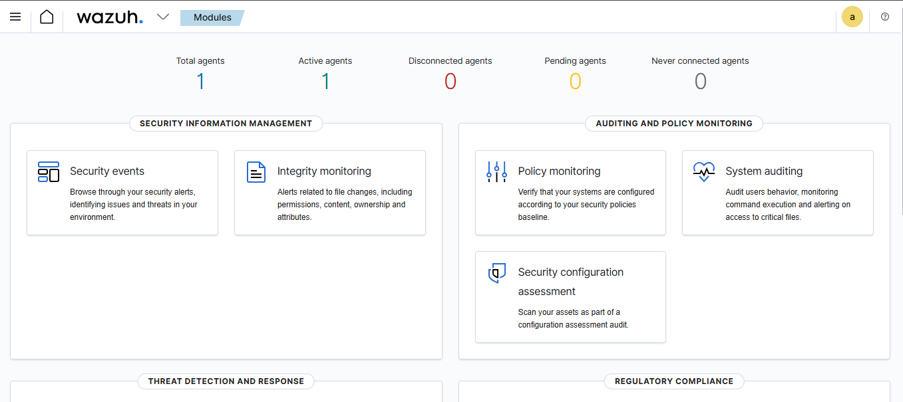
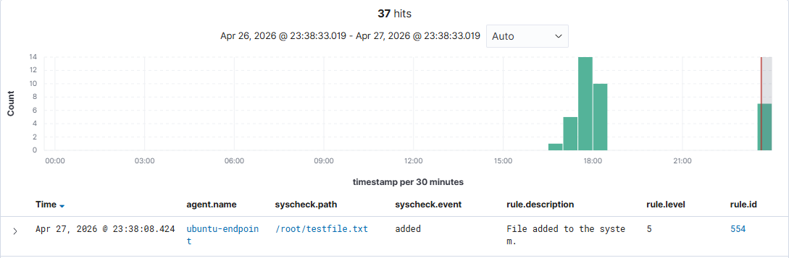
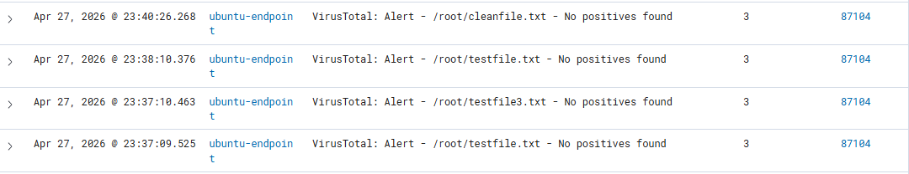
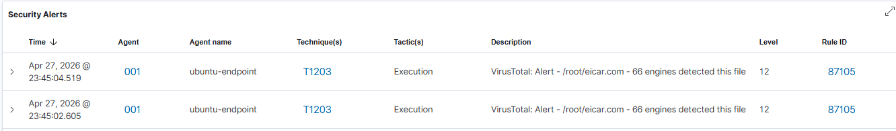
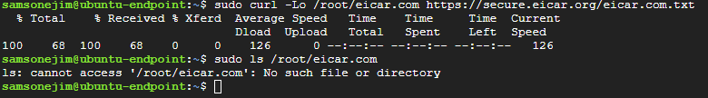
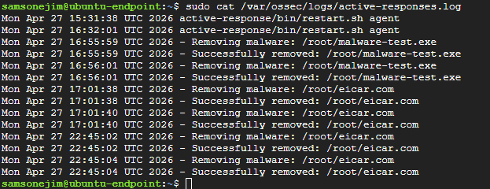
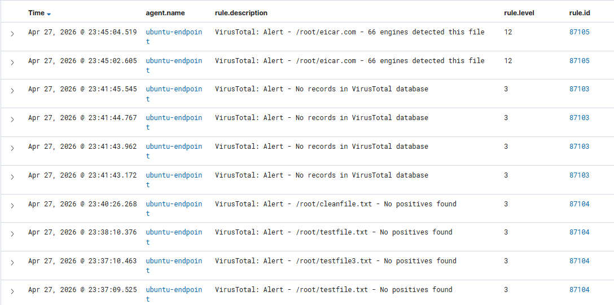

# 🛡️ Wazuh + VirusTotal SOC Lab: Automated Malware Detection & Response on GCP


📄 **[Download the Full Step-by-Step Beginner Guide (PDF)](docs/Wazuh_VirusTotal_GCP_Guide.pdf)**

---

## 👤 Author

**Samson Ejim**
Cybersecurity Enthusiast | SOC | Threat Detection & Incident Response

---

## 📌 Project Overview

This project simulates a real-world SOC (Security Operations Center) scenario where a privileged Linux server is targeted by an unauthorized malware drop. Using **Wazuh SIEM** deployed on **Google Cloud Platform (GCP)**, I designed and implemented a complete detection and automated response pipeline that:

- Detects unauthorized file changes in real-time using **File Integrity Monitoring (FIM)**
- Enriches every alert with external threat intelligence via **VirusTotal API**
- Automatically removes confirmed malware using **Wazuh Active Response**
- Provides full visibility through the **Wazuh Security Dashboard**

No pre-configured tooling was used. Everything was built from scratch following enterprise-grade practices.

---

## 🏢 Scenario

### Organization Context
A mid-size technology company hosts internal tools and sensitive automation scripts on Linux servers. One of these systems is a critical Ubuntu server used exclusively by senior administrators. This server has **no business purpose for downloading files from the internet**, especially into privileged directories such as `/root`.

Due to recent threat intelligence reports indicating malware campaigns targeting Linux servers, management instructed the SOC to deploy a host-based detection and automated response solution capable of:

- Detecting unauthorized file changes
- Enriching alerts using external threat intelligence
- Automatically responding to confirmed threats

### Incident Trigger
During routine monitoring, the SOC notices abnormal file activity occurring under the `/root` directory of an Ubuntu endpoint. Shortly afterward, a file placed in `/root` is identified by VirusTotal as **known malware flagged by 66 detection engines**.

### SOC Questions to Answer
- How was the activity detected?
- Is the threat real?
- What automated actions were taken?
- Is the system safe after the response?

---

## 🏗️ Architecture

```
┌─────────────────────────────────────────────────────────────┐
│                    Google Cloud Platform                     │
│                                                             │
│  ┌─────────────────────┐      ┌──────────────────────────┐  │
│  │   wazuh-server VM   │      │   ubuntu-endpoint VM     │  │
│  │   (e2-standard-4)   │      │   (e2-medium)            │  │
│  │                     │      │                          │  │
│  │  ┌───────────────┐  │      │  ┌────────────────────┐  │  │
│  │  │ Wazuh Manager │◄─┼──────┼──│   Wazuh Agent      │  │  │
│  │  │ Wazuh Indexer │  │      │  │   (v4.7.5)         │  │  │
│  │  │ Wazuh Dashboard│  │      │  └────────────────────┘  │  │
│  │  │ Integratord   │  │      │                          │  │
│  │  └──────┬────────┘  │      │  ┌────────────────────┐  │  │
│  │         │           │      │  │  /root directory   │  │  │
│  └─────────┼───────────┘      │  │  (FIM Monitored)   │  │  │
│            │                  │  └────────────────────┘  │  │
│            │ API Call         └──────────────────────────┘  │
│            ▼                                                 │
│  ┌─────────────────┐                                        │
│  │  VirusTotal API │                                        │
│  │  (Threat Intel) │                                        │
│  └─────────────────┘                                        │
└─────────────────────────────────────────────────────────────┘

Detection Flow:
File Dropped → FIM Alert (Rule 554) → VirusTotal Scan →
Malware Confirmed (Rule 87105) → Active Response → File Deleted
```

---

## 🛠️ Technologies Used

| Tool | Purpose |
|---|---|
| **Wazuh 4.7.5** | SIEM, FIM, Active Response engine |
| **VirusTotal API** | External threat intelligence enrichment |
| **Google Cloud Platform** | Cloud infrastructure (2 VMs) |
| **Ubuntu 22.04 LTS** | OS for both server and endpoint |
| **Bash** | Active response scripting |

---

## ☁️ GCP Infrastructure Setup

### VM Specifications

| VM | Name | Machine Type | Disk | Purpose |
|---|---|---|---|---|
| 1 | `wazuh-server` | e2-standard-4 (4 vCPU, 16GB) | 50GB SSD | Wazuh Manager + Dashboard |
| 2 | `ubuntu-endpoint` | e2-medium (2 vCPU, 4GB) | 20GB SSD | Monitored privileged server |

### Firewall Rules
The following ports were opened on GCP VPC firewall:

| Port | Protocol | Purpose |
|---|---|---|
| `1514` | TCP | Wazuh agent communication |
| `1515` | TCP | Wazuh agent registration |
| `443` | TCP | Wazuh dashboard (HTTPS) |
| `55000` | TCP | Wazuh REST API |

---

## 🚀 Installation & Configuration

### 1. Wazuh Server (All-in-One Install)

```bash
curl -sO https://packages.wazuh.com/4.7/wazuh-install.sh
curl -sO https://packages.wazuh.com/4.7/config.yml
# Edit config.yml with server internal IP
sudo bash wazuh-install.sh -a
```

### 2. Wazuh Agent on Ubuntu Endpoint

```bash
# Import GPG key
sudo bash -c 'curl -s https://packages.wazuh.com/key/GPG-KEY-WAZUH | gpg --no-default-keyring \
  --keyring gnupg-ring:/usr/share/keyrings/wazuh.gpg --import'
sudo chmod 644 /usr/share/keyrings/wazuh.gpg

# Add repository
echo "deb [signed-by=/usr/share/keyrings/wazuh.gpg] https://packages.wazuh.com/4.x/apt/ stable main" | \
  sudo tee /etc/apt/sources.list.d/wazuh.list
sudo apt-get update

# Install agent at matching version
wget https://packages.wazuh.com/4.x/apt/pool/main/w/wazuh-agent/wazuh-agent_4.7.5-1_amd64.deb
sudo WAZUH_MANAGER="<MANAGER_INTERNAL_IP>" dpkg -i wazuh-agent_4.7.5-1_amd64.deb

# Start agent
sudo systemctl daemon-reload
sudo systemctl enable wazuh-agent
sudo systemctl start wazuh-agent
```

### 3. File Integrity Monitoring (FIM) Configuration

Edited `/var/ossec/etc/ossec.conf` on the endpoint to monitor `/root` in real-time:

```xml
<syscheck>
  <disabled>no</disabled>
  <frequency>300</frequency>
  <scan_on_start>yes</scan_on_start>

  <!-- Real-time monitoring of privileged /root directory -->
  <directories realtime="yes" check_all="yes" report_changes="yes">/root</directories>
  <directories check_all="yes">/etc,/usr/bin,/usr/sbin</directories>
  <directories>/bin,/sbin,/boot</directories>

  <ignore>/etc/mtab</ignore>
  <ignore>/etc/hosts.deny</ignore>
</syscheck>
```

### 4. VirusTotal Integration

Added to `/var/ossec/etc/ossec.conf` on the **Wazuh server**:

```xml
<integration>
  <name>virustotal</name>
  <api_key>YOUR_VIRUSTOTAL_API_KEY</api_key>
  <rule_id>554,550,553,552,551</rule_id>
  <alert_format>json</alert_format>
</integration>
```

### 5. Automated Malware Removal (Active Response)

**Response script** (`/var/ossec/active-response/bin/remove-threat.sh`) on the endpoint:

```bash
#!/bin/bash
LOCAL=$(dirname $0)
cd $LOCAL
cd ../
PWD=$(pwd)

read INPUT_JSON

FILENAME=$(echo $INPUT_JSON | python3 -c \
  'import sys, json; \
   data = json.load(sys.stdin); \
   print(data["parameters"]["alert"]["data"]["virustotal"]["source"]["file"])')

echo "$(date) - Removing malware: $FILENAME" >> /var/ossec/logs/active-responses.log
rm -f "$FILENAME"
echo "$(date) - Successfully removed: $FILENAME" >> /var/ossec/logs/active-responses.log
```

**Active response registration** on the Wazuh server config:

```xml
<command>
  <name>remove-threat</name>
  <executable>remove-threat.sh</executable>
  <timeout_allowed>no</timeout_allowed>
</command>

<active-response>
  <disabled>no</disabled>
  <command>remove-threat</command>
  <location>local</location>
  <rules_id>87105</rules_id>
</active-response>
```

---

## 🧪 Validation Test

### Test 1: FIM Detection
```bash
# On ubuntu-endpoint
sudo touch /root/testfile.txt
```
**Result:** Wazuh FIM triggered Rule **554** — "File added to the system" within 30 seconds.

### Test 2: VirusTotal Clean File
```bash
sudo bash -c 'echo "this is a clean file" > /root/cleanfile.txt'
```
**Result:** VirusTotal returned Rule **87104** — "No positives found."

### Test 3: EICAR Malware Drop & Auto-Removal
```bash
# Drop EICAR industry-standard test malware
sudo curl -Lo /root/eicar.com https://secure.eicar.org/eicar.com.txt

# Verify auto-deletion
ls /root/eicar.com
# Output: ls: cannot access '/root/eicar.com': No such file or directory ✅
```
**Result:** VirusTotal flagged the file with **66 malicious detections** (Rule **87105**, Level 12). Active response automatically deleted the file within 60 seconds.

---

## 🔍 SOC Questions — Answered

### 1. How was the activity detected?
Wazuh's **File Integrity Monitoring (FIM)** was configured to watch the `/root` directory in **real-time** using inotify. The moment any file was created, modified, or deleted, a FIM alert (Rule 554) was triggered and forwarded to the Wazuh manager.

### 2. Was the threat real?
Yes. The **VirusTotal integration** automatically hashed the dropped file and queried the VirusTotal API. The EICAR test file was confirmed malicious by **66 out of 90 antivirus engines**, triggering Rule 87105 at severity Level 12.

### 3. What automated action was taken?
Upon Rule 87105 firing, Wazuh's **Active Response** mechanism automatically executed `remove-threat.sh` on the endpoint, which extracted the malicious file path from the alert JSON and permanently deleted it using `rm -f`. The action was logged to `/var/ossec/logs/active-responses.log`.

### 4. Is the system safe after the response?
Yes. The malicious file was removed automatically before any execution could occur. The deletion was confirmed via `ls` (file not found) and the active response log. The Wazuh dashboard shows the complete alert chain with no further threats detected.

---

## 📊 Alert Chain Summary

| Rule ID | Level | Description | Trigger |
|---|---|---|---|
| `554` | 5 | File added to the system | FIM detects new file in `/root` |
| `87103` | 3 | No records in VirusTotal database | Unknown/new file hash |
| `87104` | 3 | No positives found | Clean file confirmed by VirusTotal |
| `87105` | 12 | Malware detected — 66 engines | EICAR confirmed malicious |

---

## 📁 Repository Structure

```
wazuh-virustotal-soc-lab/
├── README.md
├── config/
│   ├── ossec-server.conf          # Wazuh server configuration
│   ├── ossec-agent.conf           # Agent + FIM configuration
│   └── remove-threat.sh           # Active response script
├── screenshots/
│   ├── 01-agent-active.png        # Agent showing Active on dashboard
│   ├── 02-fim-alert-554.png       # FIM alert rule 554
│   ├── 03-virustotal-clean.png    # Rule 87104 clean file result
│   ├── 04-virustotal-malware.png  # Rule 87105 malware detected
│   ├── 05-file-deleted.png        # ls showing file gone
│   ├── 06-active-response-log.png # active-responses.log output
│   └── 07-full-event-timeline.png # Full security events dashboard
└── docs/
    └── architecture.md            # Detailed architecture explanation
└── docs/
    └── Wazuh_VirusTotal_GCP_Guide.pdf   ← Beginner step-by-step guide
```
## 📸 Screenshots

### Agent Active on Dashboard


### FIM Alert — Rule 554


### VirusTotal Clean File — Rule 87104


### Malware Detected — Rule 87105 (66 Engines)


### File Automatically Deleted


### Active Response Log


### Full Security Events Timeline


---

## 🔑 Key Takeaways

- **Real-time FIM** on privileged directories is a critical detection control for Linux servers
- **Threat intelligence enrichment** via VirusTotal eliminates manual triage for known malware
- **Automated active response** reduces Mean Time to Respond (MTTR) from minutes/hours to under 60 seconds
- **Version consistency** between Wazuh manager and agent is essential for proper communication
- Cloud-based SIEM deployment on GCP provides scalable, production-grade security monitoring

---

## ⚠️ Disclaimer

This lab uses the EICAR test file — an industry-standard, harmless file used specifically to test antivirus and security tooling. No actual malware was used. This project is intended for educational and portfolio purposes only.

---

## 📬 Connect With Me

- **LinkedIn:** [linkedin.com/in/samsonejim](https://linkedin.com/in/samsonejim)
- **GitHub:** [github.com/samsonejim](https://github.com/samsonejim)

---

*Built with 🛡️ by Samson Ejim*
